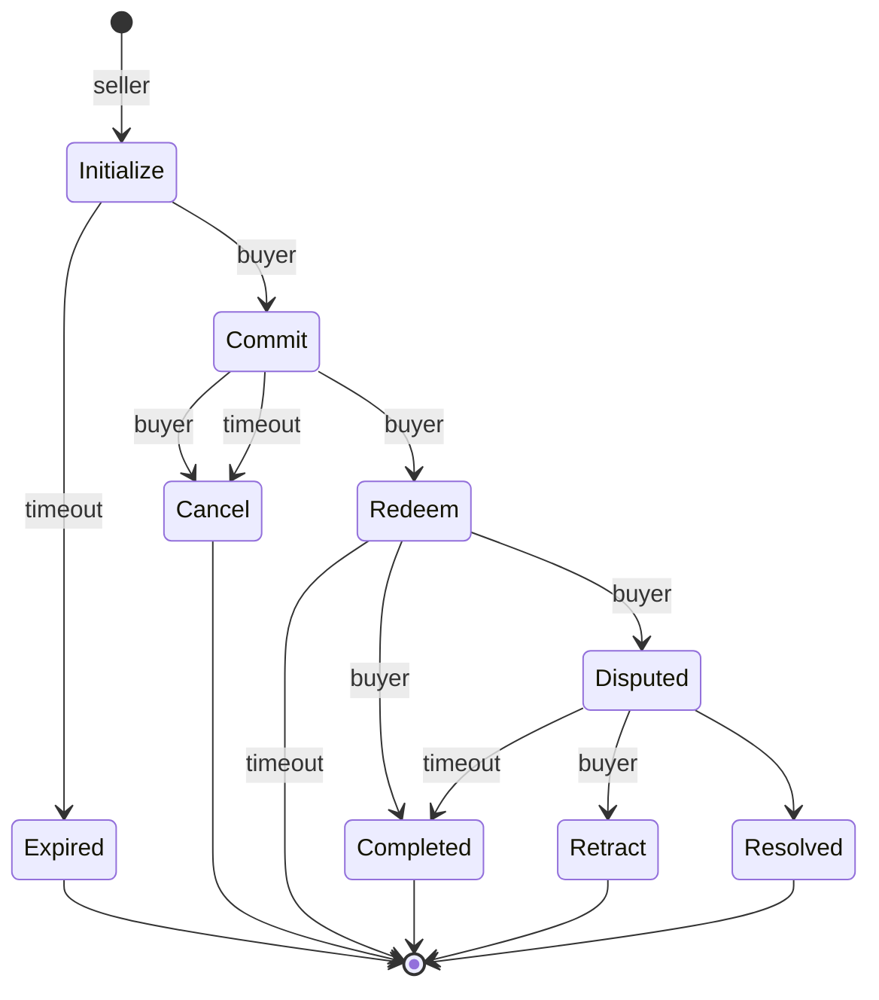

# Fair Exchange

## What is it?
Fair Exchange is a protocol to enable the exchange of goods and services on the Bionet. Overall, you can think of it as an escrow service, or trusted "middle-man", that ensures fees and assets are distributed as expected to the parties involved in an exchange. It uses incentives to encourage participants to follow the rules of the system to enforce atomic exchanges where *either both parties get what they expect, or none do*.

Our current effort is focused on a minimal viable product (MVP).  We're intentionally keeping the core logic as simple as possible as we work through the needs of the Synthetic Biology (SynBio) community.  

This work is **heavily** inspired by the great work on the [Boson protocol](https://www.bosonprotocol.io/technology/) and other research related to "fair exchange". We are adapting/extending some of Boson's concepts to support IP NFTS and the unique needs of the Bionet. We may transition to the Boson protocol in the future.

## Design
There are 3 main actors in the protocol: **buyer**, **seller**, and the **exchange**. A buyer and seller may want to exchange both digital and physical assets. The exchange contains the core logic and state machine. A state machine ensures the buyer and seller follow the rules of the system. Each state dictates the rewards and penalities that may impact the exchange.  The goal is to incentive participants to follow the rules.  And by following the rules, both parties get what they want, which helps to build trust in the system over time.

Buyers and sellers may exchange digital or physical assets (often referred to as *"phygitals"*), or a service.  The current state of SynBio often requires off-chain negotiation related to an exchange which can be time consuming. The protocol takes this into consideration and is being designed to help encourage participants to keep moving forward (through states) until the exchange is finalized.

### High-level Flow

There are 6 states in the protocol used by the exchange:
* Committed: The buyer commits to the terms of the sale and escrows the price of the asset
* Canceled: The buyer decides to abort the purchase and pays a penalty
* Revoked: The seller decides to abort the sale and pays a penalty
* Redeemed: The buyer is ready to receive the asset
* Disputed: The buyer is not happy with the exchange and files a complaint
* Completed: The buyer got what they expected. The seller is paid as expected

Example of a successful exchange:

1. The seller lists an asset on the Bionet. The asset is connected to an IP NFT that contains the terms and conditions of the asset.
2. A buyer decides to purchase the asset - "committing" to the sale by paying the agreed upon price which is escrowed by the exchange. The exchange issues a "redeemable voucher" in the form of an NFT to the buyer.  This is proof the buyer has committed to the sale.
3. When the buyer is ready for the asset, they redeem the voucher, signalling to the seller to ship or provide the asset to the buyer.
4. The buyer receives the asset and is happy with it.  They close the exchange which releases the escrowed funds to the seller and transfers the IP NFT to the buyer.

In this scenario, only 3 of the 6 states were needed. The other 3 states are used as safety nets. In reality, exchanges don't alway go as planned.

To deal with the need for off-chain negotiations in SynBio and the potential for things to go wrong, a "grace period" or timer is used in two places by the protocol:
- When a buyer commits to a purchase they have X amount of time to redeem the voucher.  During this time a seller can revoke the sale (and pay a penalty) or the buyer can decide to cancel the purchase (and pay a penalty).  If neither party does anything, the grace period will expire and the protocol will cancel the sale for them (penalizing the buyer).
- When the buyer redeems a purchase they have X amount of time to close the sale or dispute it.  Disputing the sale leads to another path (TODO). If they close the sale, it's marked as complete, funds are paid to the seller and the IP NFT is transferred to the buyer.  If the buyer does nothing, the timer expires and the protocol will close the sale.

Overall, this is designed to keep the process moving.  Either the buyer and seller must act or the protocol will act for them.

... updating the diagram ...

## Fees
Fees are used to incentive actors to do the right thing.  For example, a seller is less likely to revoke a sale when they have to pay to do so. 

The following table outlines the amount paid to each party for a given state.  For the MVP, we are using fixed fees. Fees will be configurable in the future, and most
likely administered by the Bionet DAO.
* Revoke/Cancel Fee (**RCF**) = 2% of the sale price
* Completed Sale Fee (**CF**)  = 3% of the sale price 

| State of an exchange | Seller     | Buyer       | Protocol |
| -------------------- | ---------- | ----------- | -------- |
| Voided               | 0          | 0           | 0        |
| Revoked              | -RCF       | price + RCF | 0        |
| Cancel               | RCF        | price - RCF | 0        |
| Completed            | price - CF | 0           | CF       |
| Committed            | 0          | -price      | 0        |

Voided is a state we didn't mention earlier. A seller can void a listed asset at any time. This would remove the asset from the market.  However, it does not effect existing sales made on the asset.

* When a buyer **commits** to a sale, they commit **price**. Escrowing it with the exchange.
* Only a seller can **revoke** a sale. Doing so will cost them **RCF**. This will reward the buyer with **price + RCF**
* A Buyer can **cancel** a sale. This does the opposite of revoke. Reducing the refund to the buyer by **price - RCF** and rewarding the seller with **RCF**.
* A **completed** exchange pays a fee to the protocol/network. The seller pays the fee. They will receive **price - CF**. The procotol receives **CF**

The timers mentioned earlier will enforce the same fees.

## Setup
- We use [Foundry](https://book.getfoundry.sh/) for development and testing.
- Current state is for developers only...
