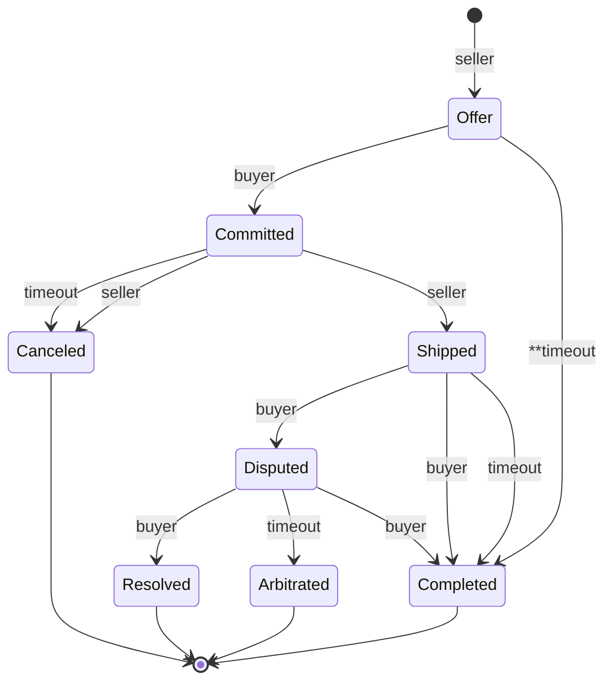
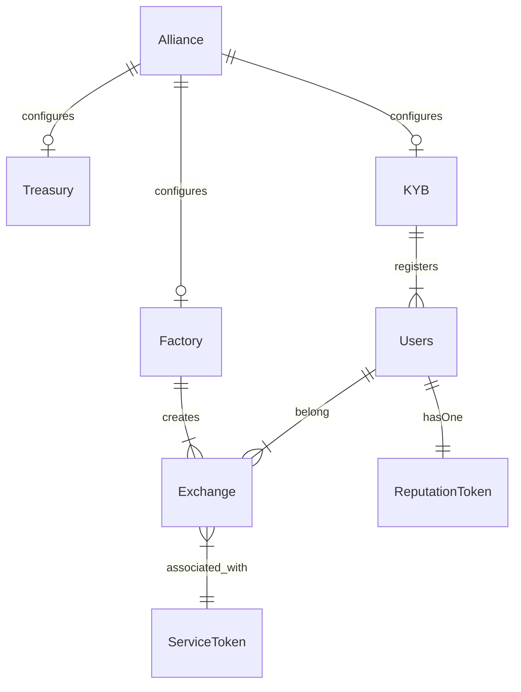
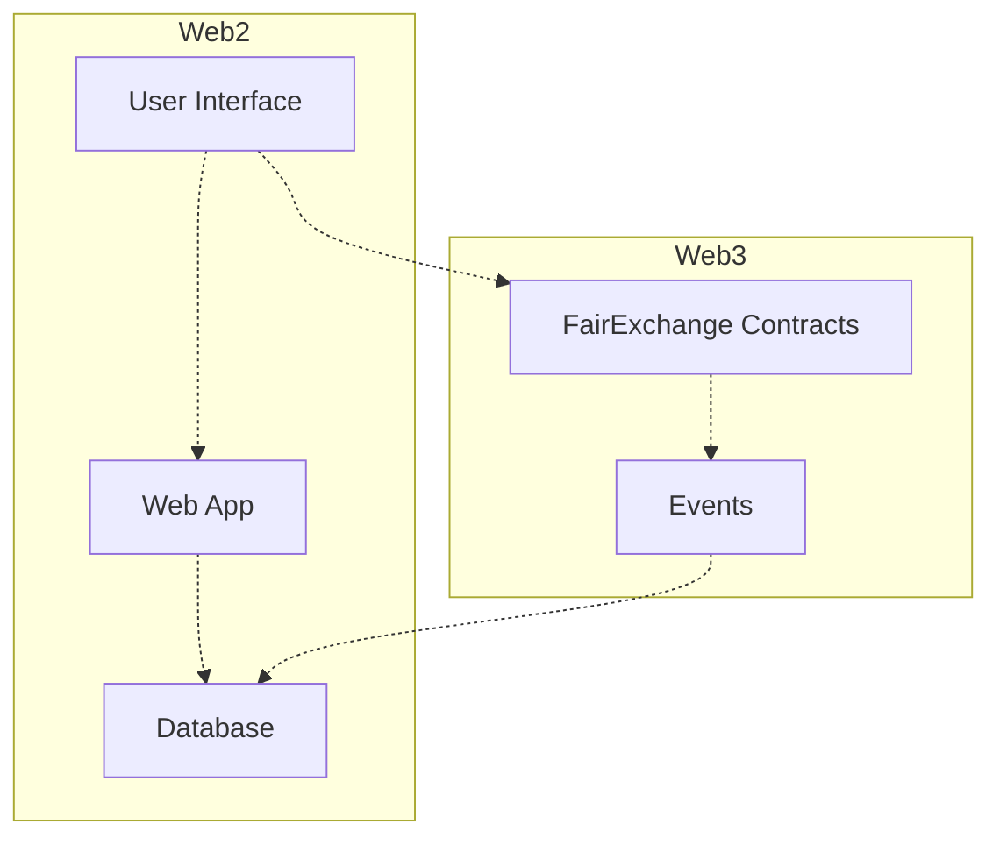

# Fair Exchange
Fair Exchange is a protocol to enable a p2p marketplace for Synthetic Biology (SynBio) services. It provides an escrow service to ensure fees and assets are distributed as expected to the parties involved in an exchange. It uses incentives to encourage participants to follow the rules of the system to enable atomic exchanges where *either both parties get what they expect, or none do*.

This work is inspired by the [Boson protocol](https://www.bosonprotocol.io/technology/) and other research related to fair exchange and tokenizing physical assets.

## Challenge
Many SynBio services produce physical products. Tracking the exchange of a physical asset with a smart contract is a challenging well known problem: [See the oracle problem](https://blog.chain.link/what-is-the-blockchain-oracle-problem/). Smart contracts alone can’t verify if an exchange took place in the physical world. They must rely on an external trusted third party (TTP) to tell them about it. For example how does a smart contract know if the:
* buyer took custody of the physical thing
* product is what the buyer expected
* service provider shipped the product
* carrier lost it or delivered to the wrong person
* product was damaged 

Many of the these things require some form of humnan intervention. But having to rely on an external source for verification can lead to a single point of failure. Which brings into question the value of using smart contracts in the first place.

A key goal of this work is find the right balance of incentives and traditional legal terms and conditions to offset the Oracle problem. 

## Design
There are 3 main actors in the protocol: **buyer**, **seller**, and the **exchange**. A seller provides a service that produces "something". A buyer wants that "something". The exchange contains the core logic and a state machine. The goal of the state machine is to ensure the buyer and seller follow the rules of the system. Each state dictates the rewards and potential penalities that may impact the exchange.  The goal is to incentive participants to follow the rules.  And by following the rules, both parties get what they want, which helps to build trust in the system over time.

The current state of SynBio often requires off-chain negotiation related to an exchange which can be time consuming. The protocol takes this into consideration and is designed to encourage participants to keep moving forward (through states) until the exchange is finalized.

## Exchange State Machine

*Simplified version derived from the Boson protocol* 

### Timers
Timers are used to motivate action.  The buyer and seller are the ones assessing what's happening - filling the gap from the Oracle problem. Either the buyer and seller must act or the protocol will act for them, possibly resulting in a penalty.

### Transition States:

#### Offer
Seller creates an exchange with a specific buyer.  The exchange contains the following information:
- Natural language terms and conditions. Exchanged between buyer and seller.
  - (Optional) URI of terms and conditions
  - Hash value of the terms and conditions
- Price
- Seller deposit (optional)
- Buyer deposit (optional)

If a seller deposit is specified it must be submitted with the offer.

Optional items:
- A timer may be set to specify the amount of time a buyer has to commit before the offer expires.
- URI of terms and conditions. The parties may not want details to be public. In this case, both parties have a local copy and can verify with the hash value published on-chain
- Deposits may not be required. This could effect the trustworthiness of the interaction. For example, if a seller doesn't make  a deposit, there's no penalty for them deviating from the protocol.

#### Committed
The buyer has committed to the offer.  At a minumum, the buyer is required to deposit the agreed 'price' of the offer and any addiitonal buyer deposit specified in the offer. In the case of SynBio services, this is when the seller may start work to create the product.

A timer is started.  See "Canceled"

## Canceled
Either the 'committed' timer has expired or the seller has explicitly canceled the exchange. If the seller cancels, the buyer will be refunded all funds deposited and the seller will forfeit any deposit made to the exchange.  Likewise, if the timer expires before the seller 'ships' a cancel will be applied.

### Shipped
The seller has shipped the product. Emitting an event the may include a hash of the shipping information and signalling to the buyer the product is in transit.  

Shipped starts a new timer to track the state of the transaction.  Within the timer, a buyer has an opportunity to 'dispute' the exchange (discussed below).  If the timer expires or the buyer initiates 
a 'completed' transaction, the exchange is finalized.

### Completed
Signifies a successful completion of the exchange.  Funds are released from escrow.  The seller is paid the 'price' of the product and refunded any deposit made.  Buyer is refunded any deposit made. A fee is paid to the protocol

#### Disputed
Only the buyer can dispute an exchange. Doing so starts the dispute phase timer. During this phase the buyer and seller work to resolve the issue. There are a few paths available to the buyer:
1. Completed:  the buyer retracts the dispute and the exchange is finalized (see completed).
2. Resolved: the buyer and seller have agreed to resolve the issue. Funds are release. This may include some form of dividing the escrowed funds.
3. Timeout: if neither party acts, the protocol will resort to some form of arbitration.  Further research is needed to determine how the protocol should handle this.

Overall, an exchange works best with proper rewards and penalties in place. Without them, an irrational, spiteful party can lock up funds, destroying trust in the system.

## Contracts

While much of this work is based on the ideas and concepts outlined by the Boson protocol. We are exploring a different architecture that is simpler and a bit more decoupled than the Diamond pattern used by Boson. One of the motivations for that is by using independent exchanges we may be able to  reduce the attack surface of escrowed funds.

*Rough outline of contracts. Subject to change*

## Sufficiently Decentralized

In a perfect world, an entire application could be built on Web3. But we're not there *yet*.  A Web3 application needs a UI, and often additional data to populate the UI for the best user-experience. Most blockchains are not designed for this kind of use. The most practical way to do that today is to host those components on a traditional Web2 stack. True decentralization is hard. But our goal should be to find the best balance possible, so we don't end up with a highly centralized application that just flies a Web3 flag.

Inspired by [this article](https://www.varunsrinivasan.com/2022/01/11/sufficient-decentralization-for-social-networks), **can we find a balance where two users can engage in a SynBio exchange even if the rest of the network wants to prevent it**?

Looking at the graph below, the goal should be to minimize the amount of data, logic, and dependencies between Web2 and Web3, such that the Web3 side can still operate while users maintain full ownership over key data and functionality.

For example, with SynBio the Web2 side should collect the minimal information needed for: 
* The market UI
* Order/Workflow 
* Contact information

This information can be backfilled from contract events and external data such as metadata from a Service tokens's URI. This is ok, as that information is available on-chain or in decentralized storage. As for the information stored on the Web2 side, users should have the ability to delete their data if they choose.

A p2p marketplace can be a powerful tool to help boost SynBio innovation and creativity. But only if it can be sufficiently decentralized from the beginning.
