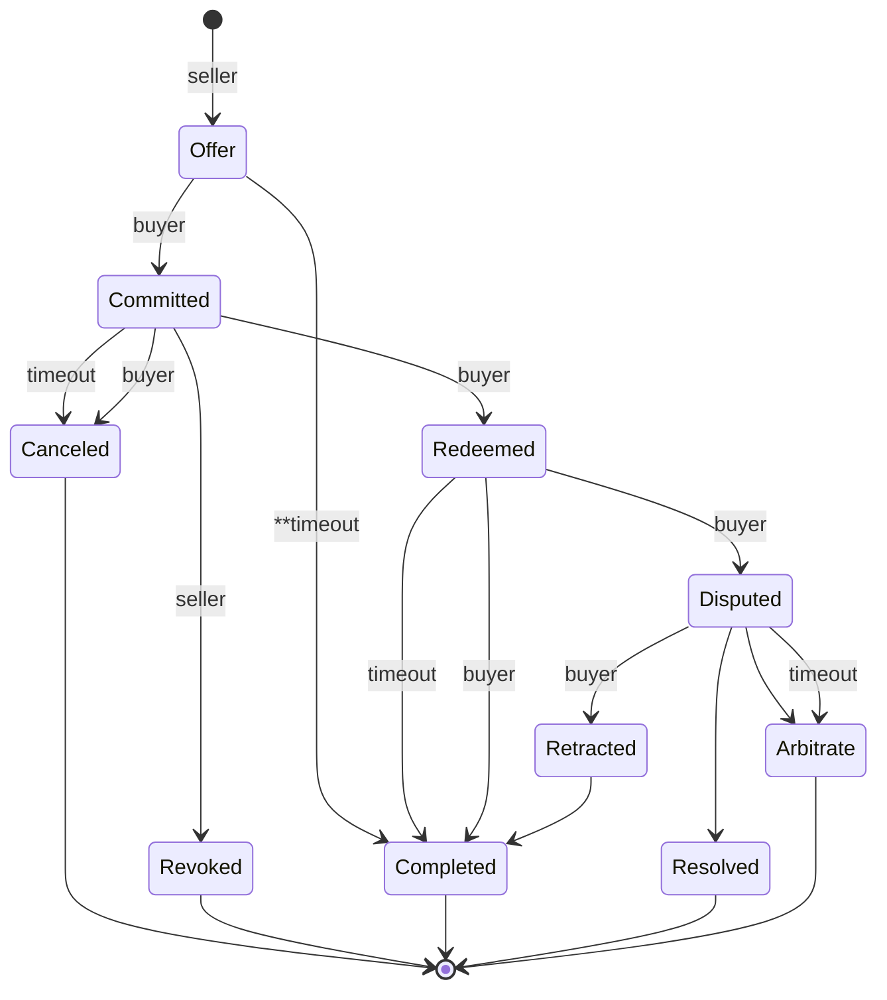
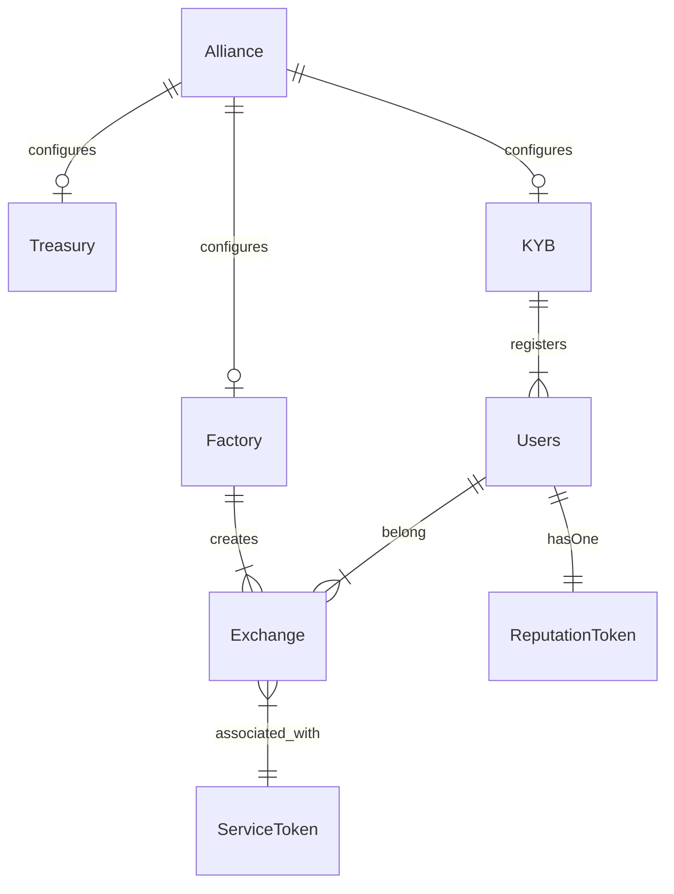
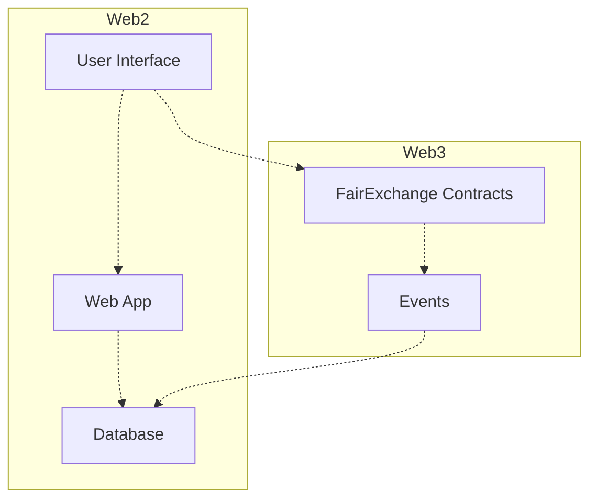

# Fair Exchange
Fair Exchange is a protocol to enable a p2p marketplace for Synthetic Biology (SynBio) services. It provides an escrow service to ensure fees and assets are distributed as expected to the parties involved in an exchange. It uses incentives to encourage participants to follow the rules of the system to enable atomic exchanges where *either both parties get what they expect, or none do*.

This work is inspired by the [Boson protocol](https://www.bosonprotocol.io/technology/) and other research related to fair exchange and tokenizing physical assets.

## Challenge
Many SynBio services produce physical products. Tracking the exchange of a physical asset with a smart contract is a challenging well known problem: [See the oracle problem](https://blog.chain.link/what-is-the-blockchain-oracle-problem/). Smart contracts alone can’t verify if an exchange took place in the physical world. They must rely on an external trusted third party (TTP) to tell them about it. For example how does a smart contract know if the:
* buyer took custody of the physical thing
* product is what the buyer expected
* service provider shipped the product
* carrier lost it or delivered to the wrong person
* product was damaged 

Many of the these things require some form of humnan intervention. But having to rely on an external source for verification can lead to a single point of failure. Which brings into question the value of using smart contracts in the first place.

A key goal of this work is find the right balance of incentives and traditional legal terms and conditions to offset the Oracle problem. 

## Design
There are 3 main actors in the protocol: **buyer**, **seller**, and the **exchange**. A seller provides a service that produces "something". A buyer wants that "something". The exchange contains the core logic and a state machine. The goal of the state machine is to ensure the buyer and seller follow the rules of the system. Each state dictates the rewards and potential penalities that may impact the exchange.  The goal is to incentive participants to follow the rules.  And by following the rules, both parties get what they want, which helps to build trust in the system over time.

The current state of SynBio often requires off-chain negotiation related to an exchange which can be time consuming. The protocol takes this into consideration and is designed to encourage participants to keep moving forward (through states) until the exchange is finalized.

## Exchange State Machine

*Work in progress - not final*

### Timers
Timers are used to motivate action.  The buyer and seller are the ones assessing what's happening - filling the gap from the Oracle problem. Either the buyer and seller must act or the protocol will act for them, possibly resulting in a penalty.

### Transition States:

#### Offer
Seller creates an exchange with a specific buyer.  The exchange contains the following information:
- Natural language terms and conditions
- URI of terms and conditions (optional)
- Hash value of the terms and conditions (fingerprint of the document)
- Price
- Seller deposit (optional)
- Buyer deposit (optional)
- Other timer settings: redeem, dispute, and offer period

If a seller deposit is specified it must be submitted with the offer.

Optional items:
- A timer may be set to specify the amount of time a buyer has to commit before the offer expires.
- URI of terms and conditions. The parties may not want details to be public. In this case, both parties have a copy and can verify with the hash value published on-chain
- Deposits may not be required. This could effect the trustworthiness of the interaction. For example, if a seller doesn't make  a deposit, there's no penalty for them deviating from the protocol.

#### Committed
The buyer has committed to the offer.  At a minumum, the buyer is required to deposit the agreed 'price' of the offer and any buyer deposit specified in the offer.

In the case of SynBio services, this is when the seller may start work to create the product.  In the meantime, the protocol issues a redeemable NFT (rNFT) to the buyer. The rNFT serves as proof of purchase and a way for the buyer to signal to the seller to ship the product by redeeming it (burning).

In the Boson protocol, the rNFT can also be used to trade and sell the offer in other markets. This may not be (initially) desirable in SynBio. So an rNFT may be non-transferable.

The redeem timer starts in this phase.  It specifies the amount of time to pass before the rNFT should be redeemed.

What could go wrong?
- Seller can't meet the terms of the offer
- Buyer decides they no longer want it
- Buyer fails to act  / redeem the offer

Regardless of the reason, the exchange needs a way to keep track of what's happening in the physical world with the offer. So it relies on the buyer and seller to tell it via a couple options:
*Note: the seller has not shipped the item yet*
- Seller revokes: buyer is refunded the 'price' and the seller's deposit (if any)
- Buyer cancels: buyer is refunded 'price' less buyer's deposit (if any)
- Redeem timer expires:  Same as buyer canceling

Any of the above can result in the end of the exchange. Otherwise the buyer redeems in a timely fashion and the state moves to the next phase.

#### Redeemed
The buyer redeems the rNFT. This burns the token signalling to the seller to ship the product - the buyer is ready to take custody.  It also starts a dispute timer. 

The dispute timer is provided to allow the buyer time to receive and evaluate the product. 

What could go wrong?
- Shipping is delayed, 
- Sent to the wrong place
- Damaged in transit
- Product is not what the buyer expected

If the buyer accepts the product, they can close out the exchange by sending a 'completed' transactions. 

If the buyer does nothing and the dispute timer expires, the protocol will automatically move to the 'completed' state.

The 'completed' state releases funds per the agreement: seller gets paid and both parties are refunded any deposits made.

Otherwise, the buyer can dispute the exchange.

#### Disputed
Only the buyer can dispute the exchange. Doing so starts the dispute phase timer. During this phase the buyer and seller work to resolve the issue. There are a few paths available to the buyer:
1. Retract the dispute and move to completing the exchange per the original agreed upon terms. Retracting leads to the 'completed' state where funds are released.
2. Parties agree to terms that resolve the dispute. For example the seller agrees to some form of refund. This will release funds based upon the agreed distribution.
3. Arbitrate - a mutual resolution cannot be reached and an external arbitrator is needed to resolve the issue. Further research is needed for how this may work in SynBio.

If the dispute timer expires before anything can be resolved, the protocol will continue to hold the funds and automatically move to arbitration.

### Final states
Indictates the Exchange is closed
* **Canceled**: Buyer aborts or redeem timer expires.  Buyer may pay a penalty
* **Revoked**: Seller aborts. May pay a penalty
* **Completed**: Exchange completed per terms. Seller is paid, buyer is refunded their deposit (if any). Protocol receives a fee.
* **Retracted**: Buyer disputed but changed their mind.  Exchange completes as normal (see 'completed')
* **Resolved**: Parties reach an agreement to resolve the issue. May result in a refund, etc...
* **Arbitrate**: An external party decides on resoltion. May result in a refund and or additional penalties

An exchange works best with proper rewards and penalties in place. Without them, an irrational, spiteful party can lock up funds, destroying trust in the system.

## Contracts

While much of this work is based on the ideas and concepts outlined by the Boson protocol. We are exploring a different architecture that is simpler and a bit more decoupled than the Diamond pattern used by Boson. One of the motivations for that is by using independent exchanges we can reduce the attack surface of escrowed funds.

## Sufficiently Decentralized

In a perfect world, an entire application could be built on Web3. But we're not there *yet*.  A Web3 application needs a UI, and often additional data to populate the UI for the best user-experience. Most blockchains are not designed for this kind of use. The most practical way to do that today is to host those components on a traditional Web2 stack. True decentralization is hard. But our goal should be to find the best balance possible, so we don't end up with a highly centralized application that just flies a Web3 flag.

Inspired by [this article](https://www.varunsrinivasan.com/2022/01/11/sufficient-decentralization-for-social-networks), **can we find a balance where two users can engage in a SynBio exchange even if the rest of the network wants to prevent it**?

Looking at the graph below, the goal should be to minimize the amount of data, logic, and dependencies between Web2 and Web3, such that the Web3 side can still operate while users maintain full ownership over key data and functionality.

For example, with SynBio the Web2 side should collect the minimal information needed for: 
* The market UI
* Order/Workflow 
* Contact information

This information can be backfilled from contract events and external data such as metadata from an NFT's URI. This is ok, as that information is available on-chain or in decentralized storage. As for the information stored on the Web2 side, users should have the ability to delete their data if they choose.

A p2p marketplace can be a powerful tool to help boost SynBio innovation and creativity. But only if it can be sufficiently decentralized from the beginning.
