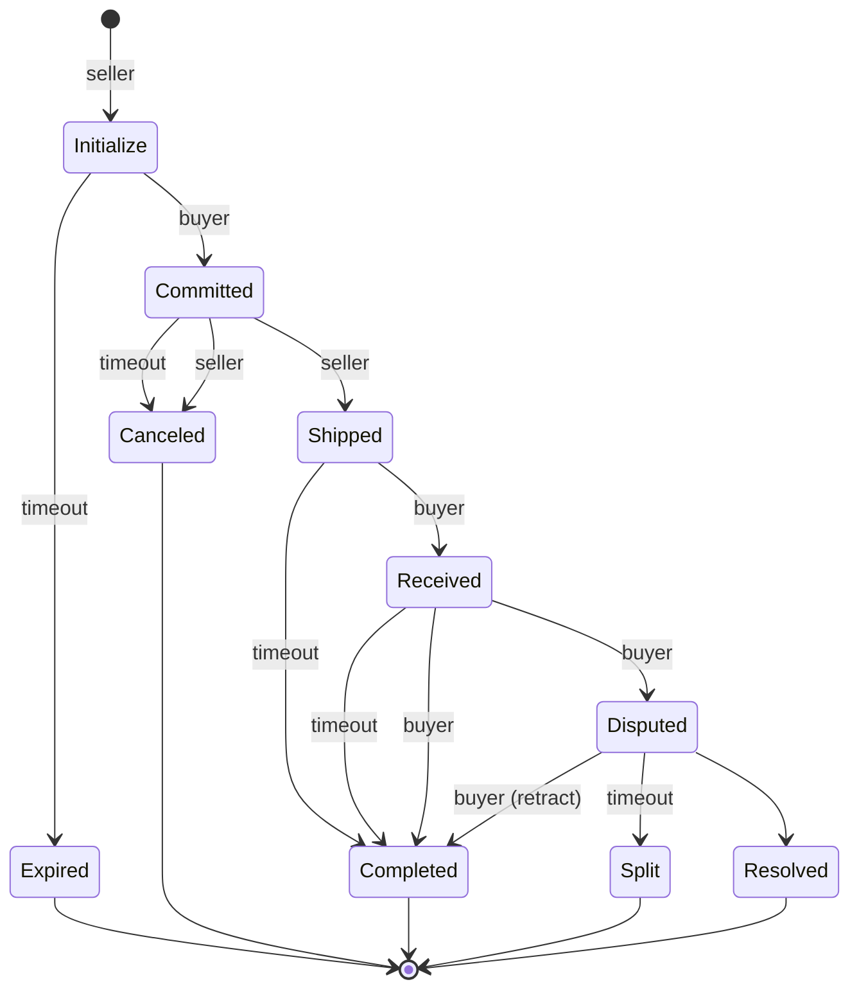
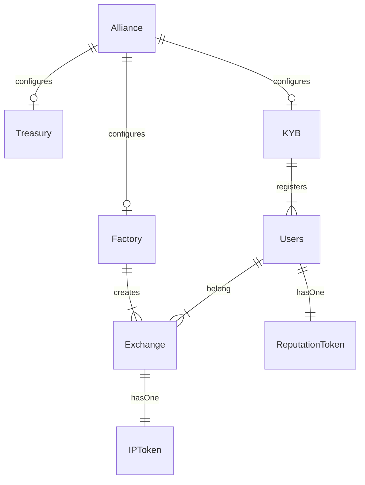
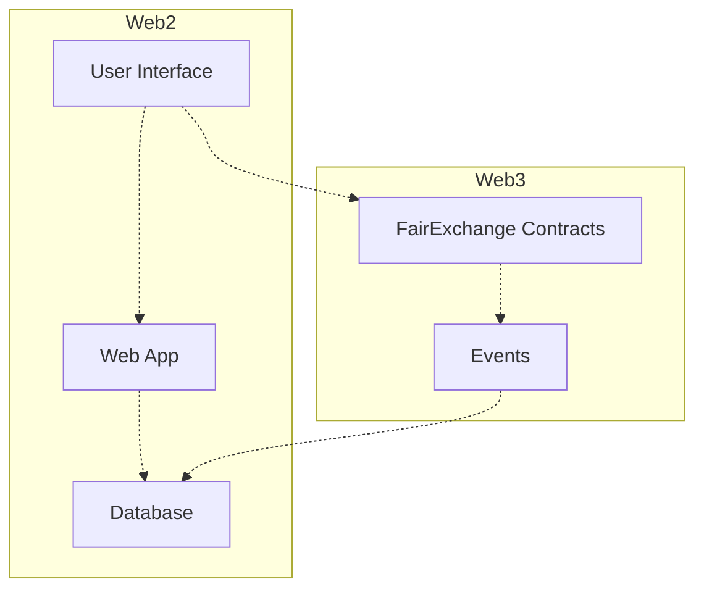

# Fair Exchange
Fair Exchange is a protocol to enable a p2p marketplace for Synthetic Biology (SynBio) services. For the most part, the protocol is an escrow service that ensures fees and assets are distributed as expected to the parties involved in an exchange. It uses incentives to encourage participants to follow the rules of the system to enforce atomic exchanges where *either both parties get what they expect, or none do*.

This work is inspired by the [Boson protocol](https://www.bosonprotocol.io/technology/) and other research related to "fair exchange".

## Challenge
The majority of SynBio services produce physical products. Tracking physical products with smart contracts leads to the [Oracle problem](https://blog.chain.link/what-is-the-blockchain-oracle-problem/):  Smart contracts are able to see all things on-chain and verify if something happened.  But they can't see things off-chain. So they must rely on something or someone to tell them about the exchange.

For example how does a smart contract know if:
* the product is what the buyer expected
* the service provider shipped the product
* the buyer received it
* the carrier lost it or delivered to the wrong person
* the product was damaged

We can have the parties to the exchange answer these questions.  But what if they're malicious or abort the exchange?  This can lead to the loss of funds and a lack of trust in the system.

A key goal of this work is find the right balance of incentives to minimize or overcome the Oracle problem. 

## Design
There are 3 main actors in the protocol: **buyer**, **seller**, and the **exchange**. A seller provides a service that produces "something". A buyer wants that "something" The exchange contains the core logic and a state machine. The goal of the state machine is to ensure the buyer and seller follow the rules of the system. Each state dictates the rewards and potential penalities that may impact the exchange.  The goal is to incentive participants to follow the rules.  And by following the rules, both parties get what they want, which helps to build trust in the system over time.

The current state of SynBio often requires off-chain negotiation related to an exchange which can be time consuming. The protocol takes this into consideration and is being designed to help encourage participants to keep moving forward (through states) until the exchange is finalized.

## State Machine
*...work in progress...*

### Transition States:
* `Initialized`: Seller creates a unique exchange with a buyer. Starts a timer. If the buyer doesn't `commit` within the timer, the offer is `expired`.  The seller may or may not have to pay a penalty fee.
* `Committed`: Buyer accepts the exchange, making a deposit towards the price. A timer is started, representing the time to do the work. Within the timer the seller must `ship` or `cancel`. Seller may pay a penalty to cancel.
    * **Problem**: what if the work takes longer than expected?
* `Shipped`: Seller ships the product to the buyer. A timer is started representing at least how long it should take for the buyer to receive it. If the timer expires before the buyer `receives`, the state transistions to `completed` releasing funds to the seller
    * **Problem**: what if shipping takes longer than expected?
* `Received`: Called by the buyer indicating they received the product.  A timer is started for the buyer to review the product. Within the timer, the buyer can either `complete` the exchange or `dispute` the order. If the buyer does nothing (timeout), the state is moved to `completed` releasing funds to the seller.
* `Disputed`: Called by the buyer to signal they have a problem with the order.  A timer is started for the parties to resolve the issue.  The buyer can `retract` the dispute `completing` the exchange and releasing funds. The parties can mutally `resolve` the issue. Or if the parties do nothing (timeout), the contract will divide the funds.
    * **Problem**: How should the contract divide the funds to prevent the buyer from gaming the process?

### Final states
Indictates the Exchange is closed
* `Expired`: Buyer didn't commit to the deal.  Seller gets back any penalty deposits made. 
* `Canceled`: Seller may pay a penalty to the buyer
* `Completed`: Happy path.  Funds are release/refunded per the terms
* `Split`: When parties do nothing the contract decides how to refund parties (split the cookie).
* `Resolved`: Parties came to an agreement. Funds are released per that agreement.

## Timers/Fees/Penalities
Timers are used to motivate engagement from the parties in the exchange and to keep the state machine moving forward.  They (buyer and seller) are the ones assessing what's happening - filling the gap from the Oracle problem. Either the buyer and seller must act or the protocol will act for them.

An exchange can work if proper rewards and penalties are in place.  Without them, an irrational or spiteful party can lock up funds and destroy all trust in the system. More research is needed to find the right balance and incentives.

## Possible financial impact of final states

Of course, this depends on the amount of seller/buyer deposits agreed upon 
at the beginning of the exchange.

* **-1** loss
* **+1** gain
* **0**  nothing gained/nothing lost

Rough guideline as starting place for more thinking on the process.

| State of an exchange | Seller     | Buyer       | Protocol |
| -------------------- | ---------- | ----------- | -------- |
| Expired              |  0         |  0          |  0       |
| Canceled             | -1         |  0          | -1       |
| Completed            | +1         | +1          | +1       |
| Split                | -1         | -1          | +1       |
| Resolved             | +1         | +1          | +1       |

## Contracts

... more detail to follow ...

## Sufficiently Decentralized

In a perfect world, an entire application could be built on Web3. But we're not there *yet*.  A Web3 application needs a UI, and often additional data to populate the UI for the best user-experience. Most blockchains are not designed for this kind of use. The most practical way to do that today is to host those components on a traditional Web2 stack. True decentralization is hard. But our goal should be to find the best balance possible, so we don't end up with a highly centralized application that just flies a Web3 flag.

Inspired by [this article](https://www.varunsrinivasan.com/2022/01/11/sufficient-decentralization-for-social-networks), **can we find a balance where two users can engage in a SynBio exchange even if the rest of the network wants to prevent it**?

Looking at the graph below, the goal should be to minimize the amount of data, logic, and dependencies between Web2 and Web3, such that the Web3 side can still operate while users maintain full ownership over key data and functionality.

For example, with SynBio the Web2 side should collect the minimal information needed for: 
* The market UI
* Order/Workflow 
* Contact information

This information can be backfilled from contract events and external data such as metadata from an NFT's URI. This is ok, as that information is available on-chain or in decentralized storage. As for the information stored on the Web2 side, users should have the ability to delete their data if they choose.

A p2p marketplace can be a powerful tool to help boost SynBio innovation and creativity. But only if it can be sufficiently decentralized from the beginning.
